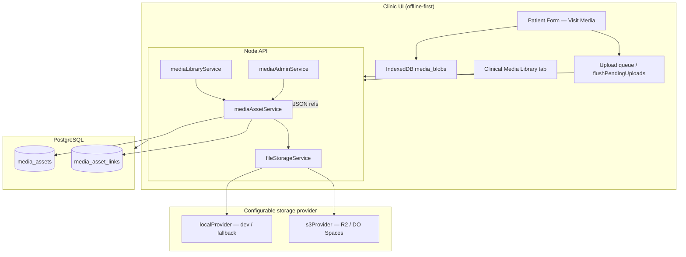

# Persistent Cloud Clinical Media Platform

Project 1 deliverable for Cornea Clinic EMR — durable object storage, centralized media library, patient timeline, and backward-compatible migration from legacy visit attachments.

## Architecture



### Design principles

| Principle | Implementation |
|-----------|----------------|
| No ephemeral production storage | `MEDIA_STORAGE_PROVIDER=s3` with R2 or DigitalOcean Spaces |
| No base64 in visit JSON (new uploads) | `CorneaMediaBlobStore` (IndexedDB) holds pending blobs |
| Backward compatible | Legacy `dataUrl` items still upload; `document` → `pdf_report` mapping |
| Offline-first | Pending blobs + `flushPendingUploads` after visit sync |
| AI-ready (not implemented) | Rich `metadata` JSONB, categories, teaching tags in schema |

## Database changes (migration 014)

File: `apps/api/src/db/migrations/014_clinical_media_platform.sql`

- **media_assets**: `storage_provider`, `bucket`, `etag`, `thumbnail_key`, `archived_at`
- **Expanded categories**: topography, tomography, specular, confocal, corneal_drawing, operative_photo, video, pdf_report, referral, teaching_case, research, other
- **media_asset_links**: `module_name`, `diagnosis_label`, `procedure_label`, `provider_user_id`, `capture_location`, `captured_at`
- Indexes for checksum dedup, archive filter, patient timeline

Run:

```bash
npm run migrate --prefix apps/api
```

## Storage strategy

### Environment variables (`apps/api/.env`)

```env
MEDIA_STORAGE_PROVIDER=local   # or s3
MEDIA_STORAGE_PATH=./data/media
MEDIA_MAX_BYTES=26214400       # 25 MB images/docs
MEDIA_MAX_VIDEO_BYTES=104857600 # 100 MB video
MEDIA_SIGNED_URL_TTL_SECONDS=3600

# S3-compatible (Cloudflare R2 or DigitalOcean Spaces)
MEDIA_S3_BUCKET=
MEDIA_S3_REGION=auto
MEDIA_S3_ENDPOINT=             # e.g. https://<account>.r2.cloudflarestorage.com
MEDIA_S3_ACCESS_KEY_ID=
MEDIA_S3_SECRET_ACCESS_KEY=
MEDIA_S3_FORCE_PATH_STYLE=true
```

### Production (DigitalOcean App Platform)

1. Create a Spaces bucket (or Cloudflare R2 bucket).
2. Set `MEDIA_STORAGE_PROVIDER=s3` and S3 env vars on the API component.
3. Remove reliance on `/tmp/media` for durable bytes — local path remains fallback for dev only.
4. Run `npm run migrate:media --prefix apps/api -- --to-s3` after deploy to copy existing local files.

### Key layout

```
{clinicId}/{category}/{year}/{month}/{assetId}/{filename}
```

## API endpoints

| Method | Path | Purpose |
|--------|------|---------|
| GET | `/api/v1/media-library` | Search, filter, sort library |
| GET | `/api/v1/media-library/timeline/patient/:patientId` | Patient cornea timeline |
| GET | `/api/v1/media-library/admin/stats` | Storage dashboard |
| GET | `/api/v1/media-library/admin/integrity` | Orphan / missing file check |
| POST | `/api/v1/visits/:id/media` | Upload (existing, enhanced) |
| GET | `/api/v1/media/:id/signed-url` | Time-limited secure URL |
| POST | `/api/v1/media/:id/archive` | Soft archive |
| POST | `/api/v1/media/:id/restore` | Restore archived |
| GET | `/api/v1/media/:id/content` | Authenticated stream |
| GET | `/api/v1/teaching-cases` | Teaching case library (list, search, tag filter) |
| PUT | `/api/v1/teaching-cases/:id` | Teaching metadata (`metadata.teaching`) |
| GET | `/api/v1/teaching-cases/:id/export` | Anonymized JSON export |
| POST | `/api/v1/teaching-cases/:id/publish` | Save anonymized snapshot to metadata |

## Frontend

| File | Role |
|------|------|
| `cornea-media-blob-store.js` | IndexedDB pending blobs (DB v7) |
| `cornea-visit-media.js` | Visit attachments, expanded categories, blob store |
| `cornea-clinical-media.js` | Library, timeline, viewer, compare, admin stats |
| `Cornea.html` | Clinical Media tab, viewer modal |

EMR section: `clinical_media` (nav tab **Clinical Media**).

## Migration plan

### Phase A — Schema (zero downtime)

1. Deploy API with migration 014.
2. Existing rows keep `storage_provider=local` default.

### Phase B — Storage cutover

1. Configure S3/R2/Spaces credentials in production.
2. Set `MEDIA_STORAGE_PROVIDER=s3`.
3. Run:

```bash
npm run migrate:media --prefix apps/api -- --to-s3
npm run migrate:media --prefix apps/api -- --scan-visits --dry-run
```

4. Review report in `migrations/reports/media-migration-*.json`.

### Phase C — Client base64 cleanup

- New uploads use blob store (no base64 in `visitMediaJSON`).
- Legacy records with `dataUrl` upload on next save/sync via existing `flushPendingUploads`.
- Anterior segment drawings: separate migration can export PNG to media assets (future script).

### Phase D — Verification

- [ ] All pre-migration media_assets rows have valid storage_key
- [ ] Sample signed URLs open in browser
- [ ] Visit media upload from offline → sync → appears in library
- [ ] Timeline shows patient-linked items chronologically

## Security review

| Control | Status |
|---------|--------|
| Authentication on all media routes | JWT required |
| Clinic scoping | All queries filter by `clinic_id` |
| Signed URLs with TTL | S3 provider + `MEDIA_SIGNED_URL_TTL_SECONDS` |
| Encryption in transit | HTTPS (TLS) |
| Audit trail | Existing `auditMutation` on upload/delete/metadata |
| Role-based EMR sections | `clinical_media` section per role |
| File validation | MIME allowlist, size limits, SHA-256 checksum dedup |
| Virus scanning | Hook placeholder: `MEDIA_VIRUS_SCAN_HOOK_URL` (wire external scanner) |
| Deletion | Soft delete + audit; archive before hard delete recommended |

## Performance review

| Technique | Notes |
|-----------|-------|
| Thumbnails | Column `thumbnail_key` reserved; generate server-side in future |
| Lazy loading | Library paginated (`limit=100`); viewer loads signed URL on demand |
| No base64 in sync payload | Reduces visit JSON size and sync bandwidth |
| IndexedDB blobs | Local preview without re-encoding |
| Checksum dedup | Avoids duplicate storage for same file |
| CDN | Optional in front of R2/Spaces for read-heavy teaching library |

## Testing checklist

### Backend

- [ ] `npm test --prefix apps/api`
- [ ] Migration 014 applies cleanly
- [ ] Upload image/PDF/video with each category
- [ ] Duplicate upload returns existing asset (checksum)
- [ ] Archive / restore
- [ ] Signed URL expires correctly
- [ ] Library search by patient name / filename
- [ ] Timeline ordered by `captured_at`
- [ ] Admin stats and integrity endpoints (admin role)

### Frontend

- [ ] Offline: add files → blobs in IndexedDB → no base64 in hidden field
- [ ] Online: flush uploads after visit save
- [ ] Clinical Media tab loads when signed in
- [ ] Viewer: zoom, rotate, brightness
- [ ] Compare A/B side-by-side
- [ ] Section hidden for receptionist (role default)
- [ ] Existing visit media list still renders
- [ ] Print summary unchanged

### Regression

- [ ] Patient records intact
- [ ] Cloud sync visits
- [ ] Keratoplasty module
- [ ] Anterior drawing studio
- [ ] Mobile layout (sidebar + media tab)

## Deployment checklist

1. [ ] Run DB migration on production PostgreSQL
2. [ ] Create object storage bucket + IAM/R2 token
3. [ ] Set API env: `MEDIA_STORAGE_PROVIDER=s3`, bucket, endpoint, keys
4. [ ] Deploy API (`apps/api`)
5. [ ] Deploy clinic UI (`apps/clinic` → Cloudflare Workers)
6. [ ] Run `migrate:media --to-s3` from trusted runner with DB + bucket access
7. [ ] Verify backup drill includes bucket lifecycle (see `scripts/backup-restore-drill.ps1`)
8. [ ] Monitor admin stats for upload failures

## AI readiness (architecture only)

Future services can consume:

- `media_assets.metadata` — teaching tags, research flags, model version
- `media_asset_links` — diagnosis, procedure, eye, visit context
- `category` — standardized modality for training pipelines
- Signed URL batch API (to add) — de-identified export for registries

No ML models are deployed in Project 1.

## Changelog (Project 1)

### Added

- S3-compatible storage provider (R2 / Spaces)
- Migration 014 — clinical media platform schema
- Media library service + admin stats / integrity
- API routes under `/media-library`
- Signed URLs, archive/restore
- IndexedDB `media_blobs` store (DB v7)
- Clinical Media Library UI tab with viewer and compare
- Expanded media categories (14+ types)
- `migrate-media-cli.js` for local→S3 and base64 scan

### Changed

- `fileStorageService` delegates to configurable provider
- `cornea-visit-media.js` uses blob store for new uploads; expanded categories
- `emr-sections` includes `clinical_media`
- Visit media API category mapping (`document` → `pdf_report`)

### Preserved

- All existing visit media upload endpoints and UI
- Offline sync workflow
- Local storage fallback for development
- Legacy base64 items until uploaded

---

*Generated as part of Master Development Plan — Phase 1, Project 1.*
