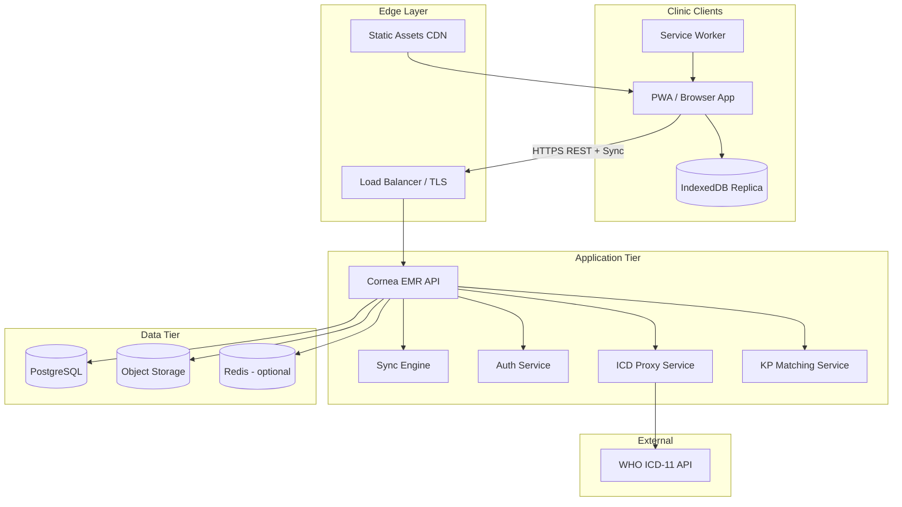
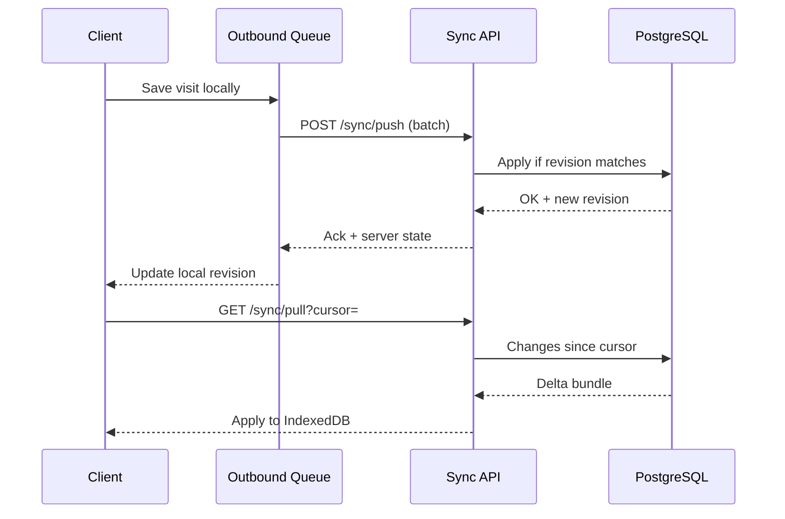
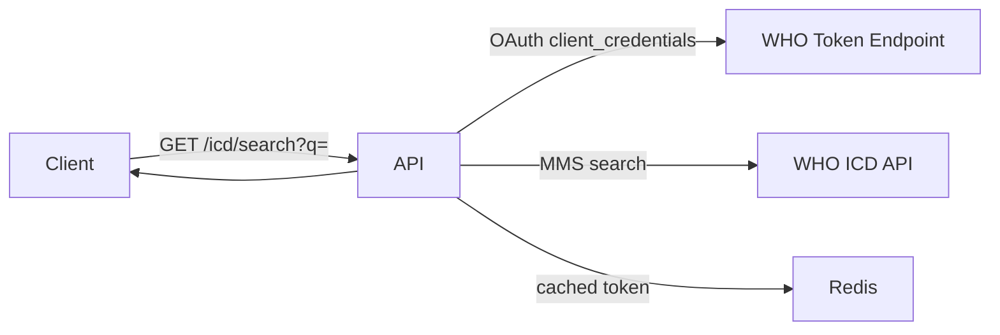

# Cornea Clinic — Production Architecture Specification

**Version:** 1.0  
**Status:** Architecture specification (no implementation)  
**Derived from:** Migration Readiness Report, MIGRATION_BLUEPRINT.md, cornea-emr v0.1  
**Last updated:** 2026-06-06

---

## 1. Purpose and scope

This document defines the **target production architecture** for Cornea Clinic as an **offline-first, multi-clinic, multi-user ophthalmology EMR** backed by **PostgreSQL**, with automatic synchronization, role-based access control, audit logging, object storage for clinical images, keratoplasty and corneal tissue registries, and WHO ICD-11 integration.

**In scope:** System boundaries, components, data model, sync protocol, security, deployment, and migration path from the current `Cornea.html` + `CorneaApi` adapter.

**Out of scope:** Implementation code, UI mockups, project schedules, cost estimates.

**Preservation requirement:** All existing clinical and operational functionality in the legacy application MUST remain available in production, including:

- Dashboard (stats, recent activity, quick actions)
- Patient visit form (all sections: demographics, history, refraction, vitals, anterior segment, fundus, diagnosis, plan, medical advice, follow-up, anterior segment drawing studio)
- Visit history sidebar, autofill from previous visit, pull previous anterior segment / fundus
- Read-only visit view, print/summary, medical advice print
- Patient records list with search
- Database management (export, import, clear) — reimplemented as authenticated admin operations with sync awareness
- Keratoplasty register (patients, tissue inventory, matching engine, tissue reservation)
- WHO ICD-11 diagnosis autocomplete (MMS 2026-01 and fallback releases)
- Lid condition autocomplete, drawing export (JSON/PNG/SVG)

---

## 2. Architecture principles

| Principle | Description |
|-----------|-------------|
| **Offline-first** | All clinical workflows MUST work without network; sync is asynchronous and automatic when online. |
| **Single logical source of truth** | PostgreSQL is authoritative; local storage is a replica + outbound queue. |
| **Tenant isolation** | Every row and API call is scoped to one organization (clinic). |
| **Legacy compatibility** | Encounter documents MUST round-trip the legacy flat JSON shape during transition. |
| **Explicit conflicts** | No silent last-write-wins without version tracking; users MUST be notified on conflict. |
| **Audit everything clinical** | Create, update, delete, view (configurable), login, export, and admin actions are logged. |
| **Secrets off the client** | WHO ICD credentials and JWT signing keys live server-side only. |
| **Images out of JSONB** | Drawings and large binaries stored in object storage; DB holds metadata and references. |

---

## 3. High-level system context



---

## 4. Logical component architecture

### 4.1 Client application (PWA)

Evolution path: replace monolithic `Cornea.html` + monkey-patched `CorneaApi` with a **modular PWA** that preserves UI/UX parity.

| Module | Responsibility |
|--------|----------------|
| **Shell** | Navigation tabs, top bar, modals, print layouts |
| **Clinical Form** | All visit sections; binds to local encounter document |
| **Drawing Studio** | SVG layers + sketch composite; writes to local blob store |
| **Records & Dashboard** | List, stats, search — reads from local replica |
| **Keratoplasty** | KP patient/tissue CRUD, matching UI, CSV export |
| **Admin** | Export/import, user prefs, ICD status (no secret display) |
| **Sync Client** | Outbound queue, inbound delta apply, conflict UI |
| **Auth Client** | Login, token refresh, role context, clinic selector |
| **ICD Client** | Autocomplete via server proxy only |

**Local persistence layers:**

| Store | Technology | Contents |
|-------|------------|----------|
| **Clinical replica** | IndexedDB | Patients (MRN index), encounters (full documents), KP patients, KP tissues |
| **Sync queue** | IndexedDB | Pending mutations with idempotency keys |
| **Blob cache** | IndexedDB or Cache API | Drawing PNGs, sketch asset, thumbnails |
| **Session** | Secure session storage | Access token, refresh token, active org id, user profile |
| **Preferences** | localStorage | UI state only — NO secrets |

### 4.2 API gateway / application server

Single **Cornea EMR API** (Node.js or equivalent) exposing:

- REST JSON API (`/api/v1/*`)
- Sync endpoints (`/api/v1/sync/*`)
- Health and metrics
- Static PWA shell (or separate CDN origin)

**Cross-cutting middleware (order):**

1. TLS termination (at load balancer)
2. Request ID / correlation ID
3. Authentication (JWT validation)
4. Organization context resolution
5. Role authorization
6. Rate limiting (per user, per org)
7. Audit hook (pre/post handler)
8. Error normalization

### 4.3 Sync engine (server-side)

Dedicated module within the API process (initially) with a path to separate worker service at scale.

Responsibilities:

- Accept batched client mutations
- Assign server timestamps and version vectors
- Detect conflicts via `updated_at` + `revision` integer
- Return delta feed since client cursor
- Idempotent replay via `client_mutation_id`
- Emit audit events for applied mutations

### 4.4 Object storage service

Abstraction over **S3-compatible** storage (AWS S3, MinIO, Azure Blob).

| Bucket prefix | Content |
|---------------|---------|
| `{org_id}/drawings/{encounter_id}/` | PNG exports, optional SVG source |
| `{org_id}/attachments/` | Future: OCT, topography imports |
| `{org_id}/exports/` | Admin-generated JSON/CSV exports (time-limited) |

Metadata in PostgreSQL `media_assets` table; bytes in object store.

### 4.5 ICD proxy service

Server-side only. Stores per-organization WHO credentials encrypted in PostgreSQL. Client sends search queries; server obtains OAuth token, calls WHO MMS search, returns normalized results.

Replaces: `clinic-server.js` `:8080/icd/*` and browser `localStorage` ICD keys.

### 4.6 Keratoplasty matching service

Port existing browser matching algorithm to server for:

- Consistent scores across users and devices
- Offline queue replay producing same results as online
- Audit trail on tissue reservation

Client MAY run a read-only cached copy of matching rules for offline preview; server result is authoritative on sync.

---

## 5. Multi-clinic (multi-tenant) model

### 5.1 Tenancy hierarchy

```
Platform
 └── Organization (Clinic)     ← tenant boundary
      ├── Users (staff)
      ├── Patients (MRN scoped)
      ├── Encounters
      ├── Keratoplasty registers
      ├── Tissue inventory
      ├── ICD credentials
      └── Audit logs
```

### 5.2 Organization (clinic) entity

| Attribute | Description |
|-----------|-------------|
| `id` | UUID |
| `name` | Display name (e.g. "Cornea Clinic Lahore") |
| `slug` | URL-safe identifier |
| `settings` | JSON: timezone, default visit statuses, feature flags, retention policy |
| `status` | `active`, `suspended` |

**Rules:**

- Users belong to exactly one organization in v1; v2 may add cross-clinic locum via membership table.
- MRN (`patientId`) is unique per organization, not globally.
- All queries MUST include `organization_id` from JWT — never from client body alone.

### 5.3 Clinic switching (future-ready)

Architecture reserves `user_organization_memberships` for users who work at multiple clinics. Initial production: one membership per user.

---

## 6. Authentication and authorization

### 6.1 Authentication model

| Aspect | Specification |
|--------|---------------|
| Protocol | OAuth 2.0–style **JWT access token** + **refresh token** |
| Access token lifetime | 15 minutes |
| Refresh token lifetime | 7 days (rotating refresh) |
| Storage (client) | Access: memory; Refresh: HttpOnly secure cookie OR encrypted IndexedDB |
| Password storage | bcrypt (cost ≥ 12) or external IdP (Auth0, Azure AD) |
| MFA | Recommended for `admin` role in production |
| Session revocation | Server-side refresh token family invalidation |

**Login flow:**

1. `POST /api/v1/auth/login` → access + refresh tokens, user profile, organization
2. Client stores session; sync client starts
3. `POST /api/v1/auth/refresh` before access expiry
4. `POST /api/v1/auth/logout` revokes refresh family

**Removed from production client:** Hard-coded credentials in HTML.

### 6.2 Role-based access control (RBAC)

| Role | Permissions summary |
|------|---------------------|
| **admin** | User management, ICD credential management, org settings, full data export/import, audit log read, all clinical write |
| **doctor** | Full clinical read/write, KP register write, finalize encounters, delete own drafts |
| **refractionist** | Refraction section write, read-only other sections unless granted |
| **nurse** | Vitals, history, investigations write; read clinical |
| **clerk** | Demographics, scheduling fields, records search; no clinical exam write |

**Enforcement layers:**

1. API middleware (`requireRole`, fine-grained `requirePermission`)
2. Sync engine (reject queued mutations user cannot perform)
3. UI (hide/disable controls — not sole enforcement)

**Permission matrix (stored as code + optional DB overrides):**

| Resource | admin | doctor | refractionist | nurse | clerk |
|----------|-------|--------|---------------|-------|-------|
| Encounter create/edit | ✓ | ✓ | partial | partial | partial |
| Encounter finalize | ✓ | ✓ | — | — | — |
| Encounter delete | ✓ | ✓ | — | — | — |
| Patient demographics | ✓ | ✓ | read | ✓ | ✓ |
| KP patient/tissue | ✓ | ✓ | read | read | read |
| Tissue reserve | ✓ | ✓ | — | — | — |
| ICD credentials | ✓ | — | — | — | — |
| Export/import | ✓ | — | — | — | — |
| Audit log | ✓ | — | — | — | — |

---

## 7. Offline-first synchronization architecture

### 7.1 Design goals

- Zero data loss when connectivity drops mid-visit
- Automatic background sync on reconnect
- Deterministic conflict detection
- Support for multiple devices per user
- Preserve legacy flat encounter documents during Phase 1 sync

### 7.2 Sync topology

**Model:** *Client-owned replica with server-authoritative merge* (not pure CRDT; versioned entities with conflict branches).



### 7.3 Local entity versioning

Every syncable entity locally stores:

| Field | Purpose |
|-------|---------|
| `id` | Server UUID (assigned on first successful push) |
| `local_id` | Legacy numeric id (maps to `legacy_local_id`) |
| `revision` | Monotonic integer from server |
| `updated_at` | Server timestamp |
| `sync_status` | `synced`, `pending`, `conflict`, `error` |
| `client_mutation_id` | UUID for idempotent push |

### 7.4 Outbound queue

Stored in IndexedDB `sync_queue`:

| Field | Description |
|-------|-------------|
| `mutation_id` | Client-generated UUID |
| `entity_type` | `encounter`, `patient`, `kp_patient`, `kp_tissue`, `media` |
| `operation` | `create`, `update`, `delete`, `reserve` |
| `payload` | Full or partial document |
| `base_revision` | Expected server revision (optimistic lock) |
| `created_at` | Client timestamp |
| `attempts` | Retry count |
| `last_error` | Server error message |

**Processing rules:**

1. Queue drains FIFO per entity type
2. Exponential backoff on 5xx / network errors
3. Stop and surface UI on 409 conflict
4. Idempotent: same `mutation_id` replayed returns original result

### 7.5 Inbound delta feed

`GET /api/v1/sync/pull?cursor={token}&limit=500`

Response bundle:

- `cursor` — opaque continuation token
- `changes[]` — each with `entity_type`, `operation`, `data`, `revision`
- `deleted[]` — tombstone ids
- `server_time` — clock reference

Client applies atomically in one IndexedDB transaction per batch.

### 7.6 Conflict handling

**Detection:** Push rejected when `base_revision ≠ server.revision`.

**Resolution strategies (in order):**

1. **Auto-merge** — non-overlapping field changes (future enhancement)
2. **Server-wins default** — for admin-configured entities (tissue status)
3. **User choice** — side-by-side diff for encounter documents; user picks or merges manually
4. **Branch** — optional `encounter_conflict_copies` table for audit

**UI requirement:** Conflict badge on records list; blocking modal before overwrite.

### 7.7 Offline capability matrix

| Feature | Offline create | Offline edit | Offline read | Sync required for |
|---------|----------------|--------------|--------------|-------------------|
| New visit | ✓ | ✓ | ✓ | First push |
| Edit saved visit | ✓ | ✓ | ✓ | Push |
| Dashboard stats | ✓ (local) | — | ✓ | Refresh when online |
| Records search | ✓ (local index) | — | ✓ | New records from other users |
| Pull previous exam | ✓ (local history) | — | ✓ | Other device’s visits |
| Drawing studio | ✓ | ✓ | ✓ | Media upload |
| KP register | ✓ | ✓ | ✓ | Push |
| KP matching | ✓ (cached rules) | — | ✓ | Reservation commit |
| ICD autocomplete | — | — | — | Network (lookup only) |
| Print/summary | ✓ | — | ✓ | — |

### 7.8 Connectivity and service worker

- **Service worker** caches app shell, sketch PNG, fonts, icons
- **Background Sync API** (where supported) retries queue drain
- **BroadcastChannel** syncs tabs on same device
- **Online indicator** in UI; sync status per record

---

## 8. Data architecture (PostgreSQL)

### 8.1 Storage strategy — phased normalization

**Phase A (production launch):** Hybrid — matches current v0.1

- `patients` — master demographics
- `encounters.payload` JSONB — full legacy flat document minus extracted media refs
- `kp_patients`, `kp_tissues` — structured columns (already in v0.1)
- `media_assets` — drawing references

**Phase B (optional):** Normalize high-value sections

- `encounter_refraction`, `encounter_exam_anterior`, `encounter_exam_fundus`, `encounter_follow_up`, `encounter_medical_advice` rows
- JSONB retained as denormalized cache for export compatibility

**Rule:** API MUST accept and return legacy flat shape throughout Phase A and B.

### 8.2 Core tables (production)

#### Tenancy and auth

- `organizations`
- `users`
- `user_sessions` (refresh token hashes)
- `role_permissions` (optional override table)

#### Clinical

- `patients` — `(organization_id, mrn)` unique
- `encounters` — visit header + `payload` JSONB + `legacy_local_id` + `revision` + `status`
- `encounter_media` — links encounters to `media_assets`

#### Keratoplasty

- `kp_patients` — full register fields from legacy app
- `kp_tissues` — inventory + grading fields
- `kp_tissue_reservations` — audit of reserve/release events
- `kp_match_snapshots` — optional cached match results

#### Integration

- `icd_credentials` — encrypted `client_id`, `client_secret` per org
- `icd_search_log` — optional usage audit (query hash, not PHI)

#### Sync and audit

- `sync_cursors` — per-device last pull cursor
- `client_mutations` — idempotency log
- `audit_log` — append-only; immutable

#### Media

- `media_assets` — id, org_id, type, storage_key, mime, size, checksum, created_by, created_at

### 8.3 Encounter payload contract

The JSONB payload MUST contain all legacy form fields not promoted to columns, including:

- Clinical history, refraction grid, vitals, anterior segment, fundus, diagnosis, plan
- `medicalAdviceJSON`
- Follow-up fields (`followUpDate`, `followUpPlace`, `followUpPurpose`, `followUpSeverity`, `followUpRemarks`, `followUpInterval`)
- Drawing references: `anteriorDrawingJSON` (SVG metadata), `anteriorDrawingMediaId` (replaces inline base64)
- `lastModified` (client) — informational only; server uses `updated_at`

**Migration note:** Existing records with embedded base64 images are ingested once; re-uploaded to object storage; payload updated to reference ids.

### 8.4 Indexing strategy

| Index | Purpose |
|-------|---------|
| `(organization_id, mrn)` on patients | Lookup |
| `(organization_id, updated_at DESC)` on encounters | Sync pull, dashboard |
| `(organization_id, legacy_local_id)` on encounters | Legacy adapter |
| `(patient_id, visit_date)` on encounters | Visit history |
| GIN on `encounters.payload` | Field search (Phase A) |
| `(organization_id, kp_patient_id)` unique | KP register |
| `(organization_id, tissue_status)` on kp_tissues | Matching |

### 8.5 Relationships

```
Organization 1──* Users
Organization 1──* Patients
Patient 1──* Encounters
Encounter 1──* Encounter_media *──1 Media_assets
Organization 1──* Kp_patients
Organization 1──* Kp_tissues
Kp_tissue 0──1 Kp_patient (via reserved_for / reservation table)
User 1──* Audit_log entries
```

**Legacy equivalence:**

- Old IndexedDB `patients` store row = one **Encounter** (+ embedded demographics duplicated into **Patient** master)
- Visit history = all Encounters sharing `patient.mrn`
- KP stores map 1:1 to `kp_patients` / `kp_tissues`

---

## 9. Object storage and image handling

### 9.1 Anterior segment drawings

| Stage | Behavior |
|-------|----------|
| **Create offline** | PNG + SVG JSON stored in IndexedDB blob store; payload holds local blob keys |
| **Sync** | Client uploads via `POST /api/v1/media/presign` → PUT to object store → `POST /api/v1/media/confirm` |
| **Read** | API returns signed GET URL or proxied thumbnail |
| **Print** | Client uses local blob offline; fetches signed URL online |

### 9.2 Sketch background asset

`Anterior segment sketch.png` shipped as static PWA asset (versioned filename); same as today.

### 9.3 Size and format limits

| Limit | Value |
|-------|-------|
| Max PNG per drawing | 10 MB |
| Max SVG JSON | 2 MB |
| Allowed MIME | `image/png`, `image/svg+xml` |
| Virus scan | Optional ClamAV on upload confirm |

### 9.4 Retention

- Drawings retained per organization retention policy (default: indefinite)
- Deleted encounter → soft-delete media; purge job after 90 days

---

## 10. Keratoplasty and corneal tissue registry

### 10.1 Functional preservation

All legacy keratoplasty features MUST be preserved:

- Patient register CRUD with auto IDs (`KP-P-*`)
- Tissue inventory CRUD with auto IDs (`KP-T-*`)
- Optical and therapeutic grading (computed fields)
- Matching engine with compatibility checklist
- Tissue reservation linked to KP patient
- CSV export
- Sub-panels: patients, tissue, matching, read-only views

### 10.2 Production architecture

| Layer | Responsibility |
|-------|----------------|
| **API** | CRUD, reserve/release, matching endpoint |
| **Matching service** | Pure function: `(patient, tissue) → score + checklist` — same algorithm as legacy |
| **Sync** | KP entities in outbound queue with revision |
| **Audit** | Every reserve/release creates `audit_log` + `kp_tissue_reservations` row |

### 10.3 Tissue reservation concurrency

- `POST /api/v1/keratoplasty/reserve` uses row-level lock on tissue
- Fails with 409 if tissue not `Available`
- Offline reserve queued; replay may fail if taken — user notified

### 10.4 Separation from general encounters

Keratoplasty register is **logically separate** from ophthalmology visit encounters but shares organization and audit infrastructure. Optional future link: `kp_patients.linked_patient_mrn`.

---

## 11. WHO ICD-11 integration

### 11.1 Architecture



### 11.2 Credential management

- Stored in `icd_credentials` encrypted at rest (AES-256-GCM, KMS-managed key)
- Only `admin` can `PUT /api/v1/icd/credentials`
- Client NEVER receives client secret after initial save
- Per-organization credentials (multi-clinic)

### 11.3 Search behavior (preserved)

- MMS linearization releases: `2026-01`, `2024-01`, `2023-01` fallback
- Minimum query length: 2 characters
- Debounced autocomplete in diagnosis field
- Insert format: `{title} (ICD-11: {code})`

### 11.4 Offline behavior

- ICD autocomplete **requires network** — UI shows offline status (same as today)
- Previously entered diagnosis text always available offline

### 11.5 Deprecation

- Remove `clinic-server.js` ICD proxy from production path
- Remove `localStorage` ICD key storage

---

## 12. Audit trail

### 12.1 Requirements

- Append-only, tamper-evident (hash chain optional Phase 2)
- Retained minimum 7 years (configurable per org)
- Searchable by admin: user, date, entity, action

### 12.2 Events logged

| Category | Actions |
|----------|---------|
| Auth | login, logout, failed login, password change, token refresh |
| Clinical | encounter create/update/delete/finalize, patient update |
| KP | kp patient/tissue CRUD, reserve, release, match run |
| Media | upload, delete |
| Admin | export, import, clear, user CRUD, ICD credential change |
| Sync | conflict detected, conflict resolved |
| ICD | credential update (not search text) |

### 12.3 Audit record shape

| Field | Description |
|-------|-------------|
| `id` | UUID |
| `organization_id` | Tenant |
| `user_id` | Actor (null for system) |
| `entity_type` | e.g. `encounter`, `kp_tissue` |
| `entity_id` | UUID |
| `action` | Verb |
| `diff` | JSONB field-level before/after (PHI-aware redaction in exports) |
| `ip_address` | Request IP |
| `user_agent` | Client info |
| `created_at` | Timestamp |

### 12.4 Clinical read audit (optional flag)

Organizations may enable `audit_log_reads` for compliance; logs encounter views.

---

## 13. API specification (production surface)

Base URL: `https://{clinic-domain}/api/v1`

### 13.1 Auth

| Method | Path | Description |
|--------|------|-------------|
| POST | `/auth/login` | Email + password |
| POST | `/auth/refresh` | Rotate tokens |
| POST | `/auth/logout` | Revoke session |
| GET | `/auth/me` | Profile + role + org |
| POST | `/auth/change-password` | Authenticated |

### 13.2 Sync

| Method | Path | Description |
|--------|------|-------------|
| POST | `/sync/push` | Batch mutations with idempotency |
| GET | `/sync/pull` | Delta feed since cursor |
| GET | `/sync/status` | Queue diagnostics for device |
| POST | `/sync/resolve-conflict` | Submit user merge decision |

### 13.3 Patients and encounters

| Method | Path | Description |
|--------|------|-------------|
| GET | `/patients` | Search by MRN, name, phone |
| GET | `/patients/by-mrn/{mrn}` | Master patient |
| GET | `/encounters` | List with filters |
| GET | `/encounters/stats` | Dashboard |
| GET | `/encounters/{id}` | Full legacy document |
| GET | `/encounters/legacy/{localId}` | Backward compatibility |
| GET | `/encounters/by-mrn/{mrn}` | Visit history |
| POST | `/encounters` | Create/update (also via sync) |
| DELETE | `/encounters/{id}` | Soft delete |

### 13.4 Media

| Method | Path | Description |
|--------|------|-------------|
| POST | `/media/presign` | Upload URL |
| POST | `/media/confirm` | Register asset after upload |
| GET | `/media/{id}` | Metadata + signed download URL |
| DELETE | `/media/{id}` | Soft delete |

### 13.5 Keratoplasty

| Method | Path | Description |
|--------|------|-------------|
| GET | `/keratoplasty/overview` | Dashboard counts |
| GET/POST | `/keratoplasty/patients` | Register CRUD |
| PUT/DELETE | `/keratoplasty/patients/{id}` | |
| GET/POST | `/keratoplasty/tissues` | Inventory CRUD |
| PUT/DELETE | `/keratoplasty/tissues/{id}` | |
| POST | `/keratoplasty/match` | Run matching for patient |
| POST | `/keratoplasty/reserve` | Reserve tissue |
| POST | `/keratoplasty/release` | Release reservation |

### 13.6 ICD

| Method | Path | Description |
|--------|------|-------------|
| GET | `/icd/ping` | Health |
| GET | `/icd/search` | Autocomplete (`q`, auth required) |
| PUT | `/icd/credentials` | Admin only |
| DELETE | `/icd/credentials` | Admin only |

### 13.7 Admin

| Method | Path | Description |
|--------|------|-------------|
| POST | `/admin/export` | Generate JSON/CSV export job |
| GET | `/admin/export/{jobId}` | Download link |
| POST | `/admin/import/legacy-json` | One-time migration import |
| GET | `/admin/audit` | Paginated audit search |
| GET/POST | `/admin/users` | User management |

---

## 14. Client architecture (replacing CorneaApi patch)

### 14.1 Problem with current adapter

Today's `CorneaApi` monkey-patches eight globals, leaves IndexedDB admin/KP/ICD paths untouched, and creates split-brain data stores. Production MUST NOT use this pattern.

### 14.2 Target: unified data access layer

```
UI Components
     ↓
Clinical Service (visit, KP, dashboard)
     ↓
Repository Interface
     ↓
┌────────────────┴────────────────┐
Local Repository          Sync Repository
(IndexedDB)            (queue + API client)
```

All reads write to local replica first; sync repository drains queue in background.

### 14.3 Feature module map (legacy → production)

| Legacy area | Production module |
|-------------|-------------------|
| `#patientForm` / modals | `VisitModule` |
| Drawing studio | `DrawingModule` + `MediaModule` |
| Visit history sidebar | `VisitHistoryModule` |
| Records tab | `RecordsModule` |
| Dashboard | `DashboardModule` |
| Keratoplasty tab | `KeratoplastyModule` |
| Database tab | `AdminModule` |
| ICD autocomplete | `IcdModule` |
| Print/summary | `PrintModule` (unchanged logic, new data source) |

---

## 15. Security architecture

| Domain | Control |
|--------|---------|
| Transport | TLS 1.2+ everywhere |
| Authentication | JWT + rotating refresh |
| Authorization | RBAC middleware + sync validation |
| Tenant isolation | Row-level `organization_id` checks |
| Secrets | KMS, never in client |
| PHI at rest | PostgreSQL encryption, encrypted backups |
| Object storage | Private buckets, signed URLs ≤ 15 min |
| Input validation | Schema validation on all payloads |
| Rate limiting | 100 req/min/user default |
| CORS | Explicit clinic domain allowlist |
| CSP | Strict content security policy on PWA |
| Dependencies | Automated vulnerability scanning |
| Backups | Daily PG backup, 35-day retention, tested restore |

---

## 16. Deployment architecture

### 16.1 Recommended production topology

| Component | Deployment |
|-----------|------------|
| PWA static assets | CDN (CloudFront / Cloudflare) |
| API + sync | 2+ containers behind load balancer |
| PostgreSQL | Managed service (RDS / Cloud SQL), Multi-AZ |
| Object storage | S3 / compatible |
| Redis | Optional: ICD token cache, rate limits |
| Secrets | AWS Secrets Manager / Vault |

### 16.2 Environments

| Environment | Purpose |
|-------------|---------|
| `development` | Local docker-compose |
| `staging` | Full stack, anonymized data |
| `production` | Live clinics |

### 16.3 Observability

- Structured JSON logs with request ID
- Metrics: sync queue depth, push/pull latency, conflict rate, API p95
- Alerts: DB connection failure, sync error spike, disk usage
- No PHI in logs

---

## 17. Migration path from current state

### Phase 0 — Today (v0.1)

- PostgreSQL + API running
- CorneaApi patches patient visit CRUD
- KP, ICD, admin still local

### Phase 1 — Unified sync client

- Implement sync queue + pull feed
- Replace CorneaApi patches with repository layer
- Wire KP to API
- Migrate ICD to server credentials
- Object storage for new drawings

### Phase 2 — PWA modularization

- Extract modules from Cornea.html
- Service worker + offline shell
- Remove dual-store ambiguity

### Phase 3 — Production hardening

- RBAC enforcement on all endpoints
- Conflict UI
- Audit read logging option
- Admin export/import via API jobs
- Security review

### Phase 4 — Data migration

1. Export legacy IndexedDB JSON per clinic
2. Run `admin/import/legacy-json` with org context
3. Upload embedded base64 drawings to object storage
4. Import KP stores via dedicated KP import
5. Verification: record counts, spot-check visits, matching parity test
6. Cutover: disable IndexedDB writes for clinical data

---

## 18. Non-functional requirements

| Requirement | Target |
|-------------|--------|
| Offline visit save | < 200 ms local |
| Sync push (100 mutations) | < 5 s p95 |
| Sync pull (500 changes) | < 3 s p95 |
| ICD search | < 800 ms p95 |
| Availability | 99.9% API monthly |
| RPO (data loss) | ≤ 5 minutes |
| RTO (recovery) | ≤ 4 hours |
| Concurrent users per clinic | 50 |
| Encounters per clinic | 500,000 |
| Device support | Chrome/Edge latest, Safari 16+ |

---

## 19. Functionality preservation checklist

| Legacy feature | Production home | Status in v0.1 |
|----------------|-----------------|----------------|
| Patient visit form (all sections) | Encounter payload + media | Partial (cloud save, no sync queue) |
| Visit history + autofill | Sync pull + by-mrn | Partial |
| Pull previous ant/fundus | Local replica by MRN | **Broken in cloud mode** → fix in Phase 1 |
| Anterior drawing studio | DrawingModule + object storage | Partial (base64 in JSONB) |
| Medical advice + print | Payload + PrintModule | Partial |
| Follow-up section | Payload | Partial |
| Dashboard stats | `/encounters/stats` + local cache | Partial |
| Records list + search | Local index + API | Partial |
| Export/import/clear | Admin API | **Not migrated** |
| Keratoplasty register | KP API + sync | **Not migrated** |
| Tissue matching/reserve | KP API | **Not migrated** |
| ICD autocomplete | ICD proxy API | **Not migrated** (still :8080) |
| Lid autocomplete | Client-side (preserved) | OK |
| Print clinical summary | PrintModule | OK |
| Multi-user | JWT auth | Partial (no RBAC UI) |
| Multi-clinic | organizations table | Schema only |

---

## 20. Open decisions (for stakeholder sign-off)

1. **External IdP** vs native email/password for initial launch
2. **Conflict default** for encounters: always user prompt vs auto-merge demographics
3. **Normalized tables** (Phase B) timeline vs JSONB-only long term
4. **Read audit** enabled by default for compliance jurisdictions
5. **Mobile native app** vs PWA-only for year one
6. **On-premise** deployment option for clinics without cloud connectivity

---

## 21. Summary

Production Cornea Clinic is an **offline-first PWA** with a **versioned sync protocol**, **PostgreSQL** as the system of record, **object storage** for drawings, **server-side ICD and KP matching**, and **strict multi-tenant RBAC with audit logging**. The current `CorneaApi` adapter is a transitional bridge; production replaces it with a unified repository and sync client while preserving every legacy clinical workflow documented in `MIGRATION_BLUEPRINT.md`.

**Related documents:**

- [`MIGRATION_BLUEPRINT.md`](MIGRATION_BLUEPRINT.md) — field-level inventory and proposed schema detail
- [`README.md`](../README.md) — Phase 0 setup and v0.1 API reference
