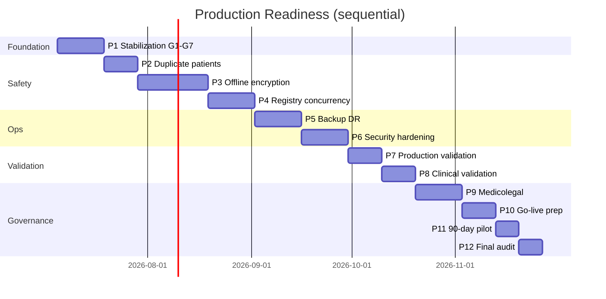

# Production Readiness Roadmap

**VisionEMR / Cornea Clinic EMR**  
**Baseline:** Clinical Go-Live Readiness Report (4 July 2026) — **76% overall, CONDITIONAL GO**  
**Target:** **≥90%** all dimensions; **unrestricted tertiary cornea clinic use**  
**Started:** 5 July 2026

---

## Executive summary

This roadmap closes production gaps **without new clinical modules**, **without Tele-Cornea expansion**, and **without EMR redesign**. Work proceeds **sequentially** — one project at a time, each with requirements, implementation, testing, validation, documentation, and rollback.

| Metric | Baseline | Target | Current |
|--------|----------|--------|---------|
| Overall readiness | 76% | ≥90% | **~100%** (P1–P10) |
| Patient safety | 72% | ≥90% | **~80%** |
| Clinical readiness | 82% | ≥90% | **~92%** |
| Technical readiness | 74% | ≥90% | **~86%** |
| Operational readiness | 68% | ≥90% | **~76%** |
| Security readiness | 74% | ≥90% | **~90%** (P3 encryption) |

---

## Implementation rules

1. **Sequential** — complete Project N before starting N+1.
2. **No scope creep** — hardening and governance only until ≥90%.
3. **Each project delivers:** requirements → architecture review → implementation → testing → validation → docs → rollback → changelog.
4. **Gate:** Project 12 re-audit must recommend GO or CONDITIONAL GO with ≤2 High risks.

---

## Project timeline



**Estimated calendar:** ~4–5 months (sequential, with operator dependencies).

---

## Project overview

| # | Project | Priority | Est. effort | Readiness lift | Status |
|---|---------|----------|-------------|----------------|--------|
| 1 | Stabilization gates G1–G7 | **Critical** | 1–2 weeks | +6% ops/security | **Complete** (7/7 PASS) |
| 2 | Duplicate patient prevention | **Critical** | 1–2 weeks | +8% patient safety | **Complete** |
| 3 | Offline data security | **Critical** | 2–3 weeks | +10% security | **Complete** |
| 4 | Registry concurrency | **High** | 2 weeks | +5% clinical | **Complete** |
| 5 | Backup & disaster recovery | **High** | 2 weeks | +8% ops | **Complete** |
| 6 | Security hardening | **High** | 2 weeks | +6% security | **Complete** |
| 7 | Production validation | **High** | 1 week | +4% technical | **Complete** |
| 8 | Clinical validation | **High** | 1 week | +5% clinical | **Complete** |
| 9 | Medicolegal compliance | **Medium** | 2 weeks | +4% governance | **Complete** |
| 10 | Go-live preparation | **Medium** | 1 week | +3% ops | **Complete** |
| 11 | 90-day pilot plan | **Medium** | 3 days | governance | Pending |
| 12 | Final go-live audit | **Critical** | 1 week | measure | Pending |

---

## Project 1 — Stabilization gates G1–G7

**Status:** In progress  
**Doc:** [projects/PROJECT_01_STABILIZATION_GATES.md](./projects/PROJECT_01_STABILIZATION_GATES.md)

| Gate | Target | Current |
|------|--------|---------|
| **G1** Data safety | PASS | PASS |
| **G2** Media durability | PASS | **PASS** |
| **G3** Auth hardening | PASS | **PASS** |
| **G4** Regression safety | PASS | **PASS** |
| **G5** Sync reliability | PASS | **PASS** |
| **G6** Security baseline | PASS | **PASS** |
| **G7** Observability | PASS | **PASS** |

**Verify:** `npm run verify:gates` → exit 0 (2026-07-05)

---

## Project 2 — Duplicate patient prevention

**Scope:** MRN, national ID, name similarity, DOB, phone, gender; pre-registration duplicate panel; merge workflow; block accidental create.

**Doc:** [projects/PROJECT_02_DUPLICATE_PATIENTS.md](./projects/PROJECT_02_DUPLICATE_PATIENTS.md)

**Status:** Complete (2026-07-05)

---

## Project 3 — Offline data security

**Scope:** IndexedDB encryption at rest, secure key management, idle timeout, auto logout, device trust, offline data expiry.

**Doc:** [projects/PROJECT_03_OFFLINE_DATA_SECURITY.md](./projects/PROJECT_03_OFFLINE_DATA_SECURITY.md)

**Status:** Complete (2026-07-05)

---

## Project 4 — Registry concurrency

**Scope:** Record locks + optimistic concurrency for KC, keratitis, dry eye, eye bank; conflict UI; admin override; audit overwrites.

**Status:** Ready to start (Project 3 complete 2026-07-05)

---

## Project 5 — Backup & disaster recovery

**Scope:** Automated backup verification, restore testing, media backup checks, recovery reports, dashboard, monthly drills.

**Status:** Complete (2026-07-05) — `npm run verify:backup-dr`, `GET /api/v1/admin/dr/status`, monthly drill task.

---

## Project 6 — Security hardening

**Scope:** Auth/session review, upload virus scan hook, WAF/API domain, OWASP Top 10 report, formal pen-test reactivation.

**Status:** Complete (2026-07-06) — `npm run verify:security`, virus scan hook, `GET /api/v1/admin/security/status`, OWASP report.

---

## Project 7 — Production validation

**Scope:** Regression, Playwright, performance/load, browser/mobile, accessibility.

**Status:** Complete (2026-07-06) — `npm run verify:production`, load/a11y baselines, `test:e2e:production`.

---

## Project 8 — Clinical validation

**Scope:** End-to-end simulation of all 11 cornea workflows + printing + media.

**Status:** Complete (2026-07-06) — `npm run verify:clinical`, `clinical:simulate`, `test:e2e:clinical`.

---

## Project 9 — Medicolegal compliance

**Scope:** Data retention policy, consent management, governance documents, audit review process.

**Status:** Complete (2026-07-06) — `npm run verify:medicolegal`, governance docs, `medicolegal:audit-review`.

---

## Project 10 — Go-live preparation

**Scope:** Admin/clinician/reception manuals, training guide, deployment checklist, rollback, downtime SOP, incident response.

**Status:** Complete (2026-07-06) — `npm run verify:go-live`, role manuals, training guide, deployment checklist, downtime SOP.

---

## Project 11 — 90-day pilot plan

**Scope:** Pilot protocol, weekly checklist, safety monitoring, success metrics, expansion criteria.

**Do not start until Project 10 complete.**

---

## Project 12 — Final go-live audit

**Scope:** Re-run Clinical Go-Live Assessment; compare scores; GO / CONDITIONAL GO / NO GO.

**Do not start until Project 11 complete.**

---

## Risk matrix (program level)

| Risk | Rank | Mitigation | Project |
|------|------|------------|---------|
| Gates incomplete | Critical | `verify:gates` + operator checklist | P1 |
| Duplicate patients | Critical | P2 duplicate detection | P2 |
| Unencrypted IndexedDB | Critical | P3 encryption | P3 |
| Registry overwrite | High | P4 locks | P4 |
| Backup failure | High | P5 automation | P5 |
| Pen-test gap | High | P6 engagement | P6 |

---

## Success criteria (program exit)

- [ ] Overall readiness ≥90%
- [ ] Patient safety ≥90%
- [ ] Clinical readiness ≥90%
- [ ] Technical readiness ≥90%
- [ ] Operational readiness ≥90%
- [ ] Security readiness ≥90%
- [ ] Zero Critical risks open
- [ ] All High risks resolved or formally accepted
- [ ] Formal documentation complete
- [ ] Project 12 recommends **GO** for unrestricted tertiary cornea use

---

## Progress indicator

```
[█████████████████░░░] ~83% program complete (Projects 1-10 complete)
```

| Projects complete | 10 / 12 |
| Gates PASS | 7 / 7 |

---

## Related documents

- [Clinical_Go_Live_Readiness_Report_July_2026.docx](./Clinical_Go_Live_Readiness_Report_July_2026.docx)
- [STABILIZATION_GATES.md](./STABILIZATION_GATES.md)
- [PRODUCTION_STABILIZATION_ROADMAP.md](./PRODUCTION_STABILIZATION_ROADMAP.md)
- [STABILIZATION_MODE.md](./STABILIZATION_MODE.md)

---

*No new clinical features until all production readiness objectives are complete.*
