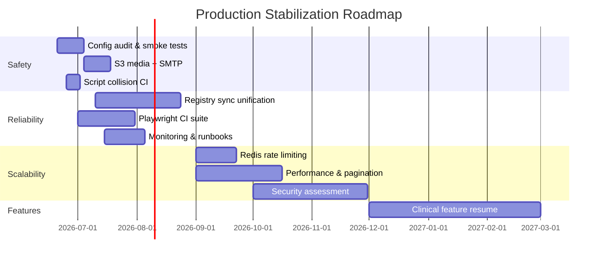

# Production Stabilization Roadmap

**Cornea Clinic EMR — cornea-emr**  
**Based on:** Global Production Audit (June 2026)  
**Principle:** Stabilize production before adding new clinical features.

---

## Executive summary

The platform scores **86/100** on clinical breadth but **78/100** on production readiness. Recent critical incidents (login recursion, Keratoplasty script load failure) show that **reliability gaps can disable entire modules silently**.

This roadmap sequences work in three layers:

| Layer | Focus | Target window |
|-------|--------|---------------|
| **1 — Safety** | PHI protection, backups, auth, media durability | Weeks 0–4 |
| **2 — Reliability** | Sync integrity, regression tests, monitoring, ops runbooks | Weeks 4–12 |
| **3 — Scalability** | Object storage, rate limits, performance, multi-user load | Months 3–6 |

**Clinical feature freeze:** No new modules (appointments, DICOM, FHIR, new registries, AI v2, etc.) until **Phase 3 exit gates** are met.

---

## Stabilization gates (exit criteria)

Production is considered **stabilized** when all gates pass:

| Gate | Criterion | Verification |
|------|-----------|--------------|
| **G1 — Data safety** | Production DB + media backed up; restore drill passed within 30 days | `backup-restore-drill.ps1` log; off-site `.dump.enc` present |
| **G2 — Media durability** | `MEDIA_STORAGE_PROVIDER=s3` on DigitalOcean; no clinical blobs on ephemeral disk | API env audit; upload + retrieve test |
| **G3 — Auth hardening** | `AUTH_EXPOSE_REFRESH_IN_BODY=false`, explicit `CORS_ORIGIN`, SMTP verified | Env checklist; password-reset email received |
| **G4 — Regression safety** | Playwright CI covers login, KP tabs, script load, sync push | CI green on `main` |
| **G5 — Sync reliability** | Visits + KP + KC + keratitis use unified or verified sync path; conflict policy documented | Sync test matrix pass |
| **G6 — Security baseline** | Global rate limiting deployed; pen-test scope defined | Redis limiter active; assessment scheduled |
| **G7 — Observability** | Health, backup, and sync failure alerts configured | Alert fired in drill |

---

## Phase 0 — Immediate hardening (Days 0–14)

**Goal:** Close known critical and high-severity operational risks from the audit.

### 0.1 Production configuration audit

| Task | Owner | Effort | Audit ref |
|------|-------|--------|-----------|
| Confirm `NODE_ENV=production` on DigitalOcean API | Ops | 1 h | Part 8 |
| Set `AUTH_EXPOSE_REFRESH_IN_BODY=false` | Ops | 30 m | S6 |
| Set explicit `CORS_ORIGIN` (not `*`) with clinic URL | Ops | 30 m | S2 |
| Verify migrations 000–019 applied on production DB | Ops | 2 h | Part 6 |
| Document current DO env vars in secure runbook (not in git) | Ops | 2 h | — |

### 0.2 Live smoke test (post-405c37c)

Run against `https://corneaclinic.visionemr.net/Cornea`:

- [ ] Cloud login completes; modal dismisses without refresh
- [ ] Keratoplasty: Overview, Patient Register, Tissue Inventory, Matching Engine tabs switch
- [ ] Visit save → sync push succeeds
- [ ] Record lock acquire/release (cloud session)
- [ ] KC registry read/write (authenticated)
- [ ] Media upload on a test visit

Record results in `backups/` or ops log with date and operator.

### 0.3 Backup and recovery

| Task | Script / doc | Done when |
|------|--------------|-----------|
| Production DB backup scheduled | `scripts/backup-production.ps1`, `setup-backup.ps1` | `CorneaEMR-ProductionBackup` task running |
| Restore drill (non-destructive) | `scripts/backup-restore-drill.ps1` | Row-count verification passes |
| Encryption key off-site copy | `backup-encryption.key` | Key stored outside clinic PC |
| Backup log review weekly | `backups/production/backup.log` | No gaps > 24 h |

**Gate progress:** G1 partial after drill; G1 complete after 30-day recurring success.

---

## Phase 1 — Safety (Weeks 2–4)

**Goal:** Ensure patient data and clinical media cannot be lost due to misconfiguration.

### 1.1 Object storage for clinical media (critical)

**Risk:** Default `MEDIA_STORAGE_PROVIDER=local` on ephemeral DO containers loses images on redeploy (Audit Part 7, S3).

| Step | Action |
|------|--------|
| 1 | Provision S3-compatible bucket (DigitalOcean Spaces or Cloudflare R2) |
| 2 | Set on production API: `MEDIA_STORAGE_PROVIDER=s3`, bucket, endpoint, keys |
| 3 | Run `npm run migrate:media` (or `migrate-media-cli.js`) to backfill existing assets |
| 4 | Verify signed URL upload/download from clinic UI |
| 5 | Include object storage in backup strategy (bucket versioning or periodic sync) |

**Exit:** G2 — all new uploads land in object storage; spot-check 10 historical assets.

### 1.2 SMTP and account recovery

| Step | Action |
|------|--------|
| 1 | Configure SMTP on production (`configure-smtp-outlook.ps1` or provider SMTP) |
| 2 | Run `npm run test:smtp` against production |
| 3 | End-to-end password reset test with real mailbox |

**Exit:** G3 partial — reset email received within 5 minutes.

### 1.3 Security quick wins

| Task | Priority | Notes |
|------|----------|-------|
| Tighten record-lock release to `kp:write` only | Medium | Audit S4 |
| Redact DB details from public `/health` or restrict to internal | Low | Audit S7 |
| Review RBAC assignments for production users | High | Principle of least privilege |
| Confirm audit log retention policy | Medium | Part 8 strengths |

### 1.4 Prevent script-load regressions

**Risk:** Global `const`/`var` collisions (e.g. `STORE_KP_PATIENTS`) silently break entire modules.

| Step | Action |
|------|--------|
| 1 | Add CI script: scan clinic JS for duplicate top-level declarations vs `storage.js` |
| 2 | Fail PR if collision detected |
| 3 | Document rule in contributor notes: no duplicate globals in specialty modules |

**Exit:** CI check merged; documented convention.

---

## Phase 2 — Reliability (Weeks 4–12)

**Goal:** Make sync, auth, and core workflows predictable under real clinic use.

### 2.1 Unified registry sync

**Risk:** KC, keratitis, graft, and eye-bank data use direct REST while visits use the main sync queue — offline edits and conflicts are inconsistent (Audit Part 12).

| Milestone | Deliverable |
|-----------|-------------|
| M2.1 | Inventory all registry write paths (client + API) |
| M2.2 | Extend sync queue schema for registry entity types OR document explicit offline-first policy per registry |
| M2.3 | Conflict resolution rules documented in `docs/SYNC_ARCHITECTURE.md` |
| M2.4 | Integration test: offline edit → reconnect → data consistent |

**Exit:** G5 — sync test matrix pass for visits, KP patients/tissues, KC registry, keratitis registry.

### 2.2 Automated regression suite (Playwright)

| Test | Covers |
|------|--------|
| Script load | No console `SyntaxError`; `switchKpPanel` defined |
| Login bootstrap | No recursion; modal closes |
| KP panel switch | All four sub-panels visible |
| Sync smoke | Mock or staging API push/pull |
| Auth 401 | Registry routes require token |

Target: run on every PR to `main` and nightly against staging.

**Exit:** G4 — CI green; failures block merge.

### 2.3 Operational runbooks

| Runbook | Contents |
|---------|----------|
| Incident response | `docs/INCIDENT_RESPONSE.md` — login down, sync stuck, API 5xx |
| Deploy & rollback | `docs/DEPLOY_ROLLBACK.md` — clinic `npm run rollback:clinic`, DO API rollback |
| Backup restore | `docs/BACKUP_RECOVERY.md` |
| Migration | Apply via API deploy; rollback cautions in `DEPLOY_ROLLBACK.md` |

### 2.4 Monitoring and alerts

| Signal | Alert when |
|--------|------------|
| API `/health` | Non-200 or DB latency > 2 s sustained |
| Backup task | Missed scheduled run |
| Sync queue depth (client telemetry or API) | Growing backlog > threshold |
| Error rate (API logs) | Spike in 5xx |

**Exit:** G7 — at least one successful alert drill.

---

## Phase 3 — Scalability (Months 3–6)

**Goal:** Support larger patient volumes, more concurrent users, and growth without architectural rework.

### 3.1 API rate limiting and HA readiness

| Task | Notes |
|------|-------|
| Deploy Redis (or DO managed Redis) for global rate limits | Replaces in-memory limiter (Audit S1) |
| Per-IP and per-user limits on auth and sync endpoints | Brute-force protection |
| Document horizontal scaling path for DO App Platform | Part 9, Part 13 |

**Exit:** G6 — rate limiter active; load test baseline recorded.

### 3.2 Performance and client scalability

| Area | Action | Audit ref |
|------|--------|-----------|
| Initial load | Defer non-critical scripts; measure LCP | Part 9 |
| Large visit lists | Server-side pagination for patient search API; client lazy load | Part 9 |
| IndexedDB | Cap or archive visits > N years locally | Part 9 |
| Media | Lazy-load clinical library thumbnails | Part 7 |

### 3.3 Codebase hardening (technical debt)

| Task | Effort | Prevents |
|------|--------|----------|
| Wrap clinic JS modules in IIFEs or migrate to ES modules | Large | Future global collisions |
| Centralize store key constants in `storage.js` only | Medium | Redeclaration bugs |
| Staging environment mirroring production | Medium | Safe pre-release validation |

### 3.4 Formal security assessment

| Step | Timeline |
|------|----------|
| Scope OWASP test (auth, sync, upload, tenant isolation) | Month 4 |
| Remediate findings before feature freeze lift | Month 5–6 |
| Re-test critical findings | Month 6 |

**Exit:** G6 complete — assessment report archived; critical/high items closed.

---

## Phase 4 — Feature readiness (after stabilization)

**Only after Gates G1–G7 pass**, resume clinical and tertiary features in this order:

| Priority | Feature | Rationale |
|----------|---------|-----------|
| P1 | Dashboard institute KPIs | Ops visibility; small effort |
| P2 | Offline research summaries | Reliability extension, not new clinical scope |
| P3 | Sirius / tomography import | CSV import done (KC + laser); Galilei / server parse deferred |
| P4 | FHIR export prototype | Cohort + patient bundles; API + UI + CI tests |
| P5 | Appointments & recall | Large; needs stable sync |
| P6 | DICOM / PACS | XL; depends on media + performance |
| P7 | New clinical modules (dry eye, OR, ML v2) | Deferred until platform proven |

---

## Deferred clinical backlog (explicit freeze list)

These items from the audit **Top 20** are **out of scope** until Phase 4:

- Appointment & recall module  
- DICOM ingest for topography/OCT  
- Dedicated dry eye / OSD module  
- OR scheduling integration  
- Teaching case library + anonymization  
- FHIR / national registry export  
- LDAP/SSO  
- Topography ML ectasia model (v2)  
- Contact lens outcomes in research tab  
- Mobile-optimized visit summary  

Exception: **bug fixes** and **security patches** in existing clinical modules remain in scope at all times.

---

## Timeline overview

---

## RACI (suggested)

| Workstream | Responsible | Accountable | Consulted | Informed |
|------------|-------------|-------------|-----------|----------|
| Backup & DR | Ops / IT | Clinic lead | Dev | All users |
| S3 / SMTP config | Dev + Ops | Clinic lead | Cloud provider | Dev team |
| Sync unification | Dev | Tech lead | Clinical informatics | Ops |
| Playwright CI | Dev | Tech lead | QA | Dev team |
| Security assessment | External + Dev | Clinic lead | Legal / DPO | Board |

---

## Success metrics

| Metric | Baseline (audit) | Target (6 months) |
|--------|------------------|-------------------|
| Production readiness score | 78 | ≥ 90 |
| Security score | 72 | ≥ 85 |
| Scalability score | 70 | ≥ 80 |
| Unplanned module outages (script load) | 2 critical in 2026 | 0 |
| Backup restore drill | Ad hoc | Monthly, logged |
| Mean API health DB latency | ~43 ms | < 100 ms p95 |
| Clinical feature releases | Continuous | 0 until gates pass |

---

## Quick start (this week)

1. Run live smoke test checklist (Phase 0.2).  
2. Execute `backup-restore-drill.ps1` against latest production dump.  
3. Audit DigitalOcean env: confirm `MEDIA_STORAGE_PROVIDER` and SMTP.  
4. Add CI duplicate-global scan for clinic JS.  
5. Schedule Phase 1 S3 migration window.

---

## Related documents

- `docs/Global_Production_Audit_Tertiary_Cornea_EMR.docx` — source audit  
- `docs/BACKUP_RECOVERY.md` — backup procedures  
- `docs/PRODUCTION_DEPLOY.md` — deployment checklist
- `docs/DEPLOY_ROLLBACK.md` — clinic/API rollback and staging E2E setup  
- `docs/SYNC_ARCHITECTURE.md` — sync design  
- `docs/PENTACAM_IMPORT.md` — Pentacam + Sirius topography CSV import
- `docs/FHIR_EXPORT.md` — FHIR R4 cohort export prototype
- `scripts/backup-restore-drill.ps1` — restore verification  

---

*This roadmap prioritizes patient data safety and platform reliability over new clinical capability. Revisit gate status monthly; lift the feature freeze only when G1–G7 are demonstrably met.*
