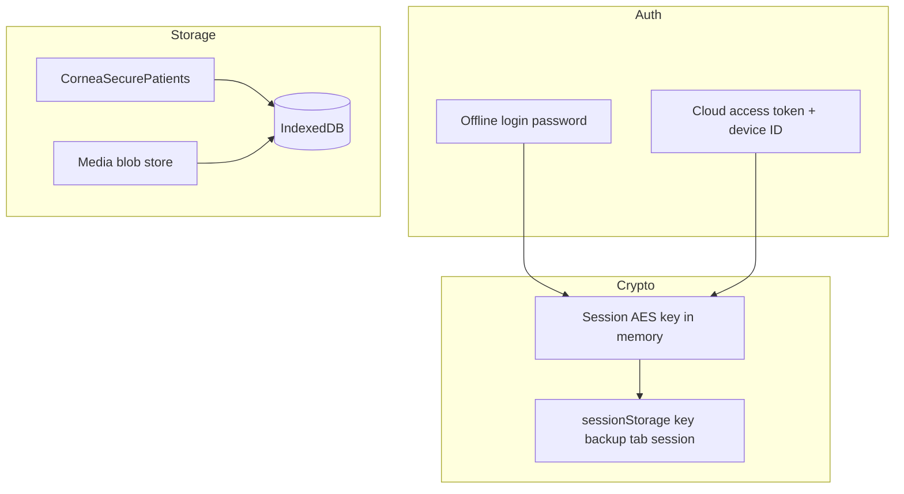

# Project 3 — Offline Data Security

**Status:** Complete  
**Started:** 5 July 2026  
**Roadmap:** [PRODUCTION_READINESS_ROADMAP.md](../PRODUCTION_READINESS_ROADMAP.md)

---

## Objective

Close the **unencrypted IndexedDB** gap flagged in the Clinical Go-Live audit. Protect local PHI on shared clinic workstations with encryption at rest, session idle lock, device trust, and offline data expiry.

**Readiness lift:** +10% security (target)

---

## Deliverables

| Item | Status |
|------|--------|
| `cornea-idb-crypto.js` — AES-256-GCM, PBKDF2/HKDF key derivation | Done |
| `cornea-secure-patients.js` — encrypted visit store wrapper | Done |
| `cornea-offline-security.js` — idle lock, device trust, expiry, lock screen | Done |
| Media blob encryption (`cornea-media-blob-store.js`) | Done |
| Cloud idle lock (15 min) + offline idle lock (30 min) | Done |
| Database tab — Offline Data Security panel | Done |

---

## Architecture

**Encrypted:** clinical visit fields (name, phone, exam data, etc.), pending media blobs  
**Plaintext metadata:** `id`, `uuid`, `patientId`, `visitDate`, sync fields (for indexes and sync)

---

## Controls

| Control | Cloud | Offline |
|---------|-------|---------|
| Idle lock | 15 minutes | 30 minutes |
| Encryption key | HKDF(token, deviceId) | PBKDF2(password) |
| Device trust | Optional 90 days | Optional 90 days |
| Local data expiry | 30 days without trust | 30 days without trust |

---

## Operator actions

1. **Database → Offline Data Security** — review status; optionally **Trust this device**
2. **Lock session now** — immediate lock for shared PC handoff
3. After idle lock — **Sign in** to unlock (cloud or offline)

---

## Validation

1. Sign in → save patient → DevTools → IndexedDB → `patients` row shows `_phiEnc` blob
2. Wait idle period (or **Lock session now**) → lock screen appears; records show `[Locked]` until sign-in
3. Trust device → status shows trusted-until date

---

## Rollback

Revert clinic commits; plain-text records remain readable (migration is additive). Remove script tags for crypto modules to disable encryption.

---

## Clinical impact

**Positive:** Shared workstation PHI protected at rest; automatic session lock.  
**Neutral:** Cloud sync unchanged; no clinical workflow change when signed in.

---

*Next: Project 4 — Registry concurrency*
